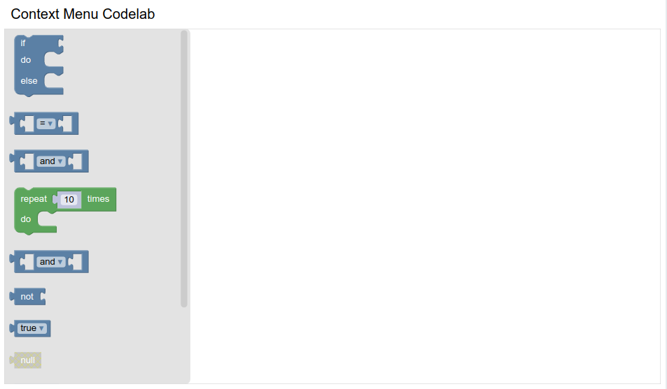
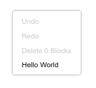
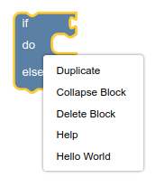
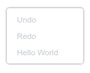

author: Blockly Team
summary: How to add a context menu option in Blockly.
id: context-menu-option
categories: blockly,codelab,contextmenu
status: Published
Feedback Link: https://github.com/google/blockly-samples/issues/new/choose

# Customizing your context menus

## Codelab overview

### What you'll learn

In this codelab you will learn how to:
- Add a context menu option to the workspace.
- Add a context menu option to all blocks.
- Use precondition functions to hide or disable context menu options.
- Customize ordering and display text for context menu options.

### What you'll build
A very simple Blockly workspace with a few new context menu options.

### What you'll need
- A browser.
- A text editor.
- Basic knowledge of HTML, CSS, and JavaScript.

This codelab is focused on Blockly's context menus. Non-relevant concepts and code are glossed over and are provided for you to simply copy and paste.

## Setup

### Download the sample code

You can get the sample code for this code by either downloading the zip here:

[Download zip](https://github.com/google/blockly-samples/archive/master.zip)

or by cloning this git repo:

```bash
git clone https://github.com/google/blockly-samples.git
```

If you downloaded the source as a zip, unpacking it should give you a root folder named `blockly-samples-master`.

The relevant files are in `examples/context-menu-codelab`. There are two versions of the app:
- `starter-code/`: The starter code that you'll build upon in this codelab.
- `complete-code/`: The code after completing the codelab, in case you get lost or want to compare to your version.

Each folder contains:
- `index.js` - The codelab's logic. To start, it just injects a simple workspace.
- `index.html` - A web page containing a simple blockly workspace.

To run the code, simple open `starter-code/index.html` in a browser. You should see a Blockly workspace with an always-open flyout.



## Add a context menu option to the workspace

In this section you will create a very basic `Blockly.ContextMenuRegistry.RegistryItem`, then register it to display when you right-click on the workspace.

### The RegistryItem

Blockly stores context menu options as items in a registry. When the user right-clicks, Blockly queries the registry for a list of context menu options that should be displayed.

Each menu option in the registry has several properties:

- `callback`: A function called when the menu option is clicked.
- `scopeType`: An enum indicating when this option should be shown.
- `displayText`: The text to show in the menu. Either a string or a function that returns a string.
- `preconditionFn`: Function that returns one of `'enabled'`, `'disabled'`, or `'hidden'` to determine whether and how the menu option should be rendered.
- `weight`: A number that determines the sort order of the option. Options with higher weights appear later in the context menu.
- `id`: A unique string id for the option.

We will discuss these in detail in later sections of the codelab.


### Make a RegistryItem

Add a function to `index.js` named `registerFirstContextMenuOptions`. Create a new registry item in your function:

```js
function registerFirstContextMenuOptions() {
    const workspaceItem = {
      displayText: 'Hello World',
      preconditionFn: function(scope) {
        return 'enabled';
      },
      callback: function(scope) {
      },
      scopeType: Blockly.ContextMenuRegistry.ScopeType.WORKSPACE,
      id: 'hello_world',
      weight: 100,
    };
}
```

Call your function from `start`:

```js
function start() {
  registerFirstContextMenuOptions();
  // Create main workspace.
  workspace = Blockly.inject('blocklyDiv',
    {
      toolbox: toolboxSimple,
    });
}
```

### Register it

Next, register your item with Blockly:

```js
function registerFirstContextMenuOptions() {
  const workspaceItem = {
    // ...
  };
  Blockly.ContextMenuRegistry.registry.register(workspaceItem);
}
```

Note: you will never need to make a new `ContextMenuRegistry`. Always use the singleton `Blockly.ContextMenuRegistry.registry`.

### Test it

Reload your web page and right-click on the workspace. You should see a new item labeled "Hello World" at the bottom of the context menu.




## Scope type

Every context menu option is registered with a **scope type**, which is either `Blockly.ContextMenuRegistry.ScopeType.BLOCK` or `Blockly.ContextMenuRegistry.ScopeType.WORKSPACE`. The scope type determines:

- Where the option should be show.
- What information is passed to the precondition and callback functions.

### Add to block scope
You registered your context menu option on the workspace scope but not the block scope. As a result, you will see it when you right-click on the workspace but not when you right-click on a block.

If you want your option to be shown for both workspaces and blocks, you must register it once for each scope type. Add code to `registerFirstContextMenuOptions` to copy and re-register the workspace item:

```js
  let blockItem = {...workspaceItem}
  blockItem.scopeType = Blockly.ContextMenuRegistry.ScopeType.BLOCK;
  blockItem.id = 'hello_world_block';
  Blockly.ContextMenuRegistry.registry.register(blockItem);
```

Notice that this code uses the JavaScript spread operator to copy the original item object, then replaces the scope type and id. Simply updating `workspaceItem` and re-registering it would modify the original registry item in place, leading to unintended behaviour.

### Test it

Drag a block into the workspace and right-click it. You should see a "Hello world" option on the block context menu.



## Precondition

Each registry item has a `preconditionFn`. This function takes in a scope and returns a string
indicating whether and how to display the context menu option. We will discuss the scope in the next section.

### Return value

The return value should be one of `'enabled'`, `'disabled'`, or `'hidden'`.

An **enabled** option is shown with black text and is clickable. A **disabled** option is shown with grey text and is not clickable. A **hidden** option is not included in the context menu at all.

For instance, let's disable `workspaceItem` for the second half of every minute:

```js
preconditionFn: function(scope) {
  const now = new Date(Date.now());
  if (now.getSeconds() < 30) {
    return 'enabled';
  }
  return 'disabled';
}
```

### Test it

Reload your workspace, grab a stopwatch, and right-click to confirm the timing. The item will always be in the menu, but will sometimes be greyed out.



## Scope

Disabling your context menu options half of the time is not useful, but you may want to show or hide an option based on what the user is doing in the workspace.

To do that you'll need to use the `scope` argument to `preconditionFn`. `scope` is a `Blockly.ContextMenuRegistry.Scope` object. It contains two properties, `workspace` and `block`, but only one is set at any time:

- If your item is registered under the `WORKSPACE` scope type you can access the `workspace` property, which is an instance of `Blockly.WorkspaceSvg`.
- If registered under the `BLOCK` scope type you can access the `block` property, which is an instance of `Blockly.BlockSvg`.

### Workspace scope

For example, let's show a **Help** option in the context menu if the user doesn't have any blocks on the workspace. Add this code in `index.js`:

```js
function registerHelpOption() {
  const helpItem = {
    displayText: 'Help! There are no blocks',
    preconditionFn: function(scope) {
      if (!scope.workspace.getTopBlocks().length) {
        return 'enabled';
      }
      return 'hidden';
    },
    callback: function(scope) {
    },
    scopeType: Blockly.ContextMenuRegistry.ScopeType.WORKSPACE,
    id: 'help_no_blocks',
    weight: 100,
  };
  Blockly.ContextMenuRegistry.registry.register(helpItem);
}
```

The precondition function accesses `scope.workspace` and uses it to check whether there are any blocks on the workspace.

### Block scope

To demonstrate block scope, add an option that is only visible when the block has an output connection:

```js
function registerOutputOption() {
  const outputOption = {
    displayText: 'I have an output connection',
    preconditionFn: function(scope) {
      if (scope.block.outputConnection) {
        return 'enabled';
      }
      return 'hidden';
    },
    callback: function(scope) {
    },
    scopeType: Blockly.ContextMenuRegistry.ScopeType.BLOCK,
    id: 'block_has_output',
    weight: 100,
  };
  Blockly.ContextMenuRegistry.registry.register(outputOption);
}
```

Don't forget to call `registerHelpOption` and `registerOutputOption` from your `start` function.

### Test it

- Reload your page and right-click on the workspace. You should see an option labeled "Help! There are no blocks".
- Add a block to the workspace and right-click on the workspace again. The **Help** option should be gone.
- Add a block with an output connection. Right-click the block and confirm that there is an option labeled "I have an output connection".
- Add an if block. Right-click the block and confirm that there is no option labeled "I have an output connection".

## Callback

The callback function determines what happens when you click on the context menu option. Like the precondition, it can use the `scope` argument to access the workspace or block.

As an example, update the help item's `callback` to add a block to the workspace when clicked:

```js
callback: function(scope) {
  Blockly.serialization.blocks.append({
    'type': 'text',
    'fields': {
      'TEXT': 'Now there is a block'
    }
  }, scope.workspace);
}
```

### Test it

- Reload the page and right-click on the workspace.
- Click the **Help** option.
- A text block should appear in the top left of the workspace.


## Display text

So far the `displayText` has always been a simple string, but it can also be a function that returns a string. This can be useful when you want a context-dependent message.

When defined as a function `displayText` accepts a `scope` argument, just like `callback` and `preconditionFn`.

As an example, add this context menu option. The display text depends on the block type.

```js
function registerDisplayOption() {
  const displayOption = {
    displayText: function(scope) {
      if (scope.block.type.startsWith('text')) {
        return 'Text block';
      } else if (scope.block.type.startsWith('controls')) {
        return 'Controls block';
      } else {
        return 'Some other block';
      }
    },
    preconditionFn: function(scope) {
      return 'enabled';
    },
    callback: function(scope) {
    },
    scopeType: Blockly.ContextMenuRegistry.ScopeType.BLOCK,
    id: 'display_text_example',
    weight: 100,
  };
  Blockly.ContextMenuRegistry.registry.register(displayOption);
}
```

As usual, remember to call `registerDisplayOption()` from your `start` function.

### Test it

- Reload the workspace and right-click on various blocks.
- The last context menu option's text should vary based on the block type.

## Weight and id

The last two properties of a registry item are `weight` and `id`.

### Weight

The `weight` property is a number that determines the order of the items in the context menu. A higher number means your option will be lower in the list.

Test this by updating the `weight` property on one of your new context menu options and confirming that the item moves to the top or bottom of the list.

Note that weight does not have to be positive or integer-valued.

### Id

Every registry item has an `id` that can be used to unregister it. You can use this to get rid of context menu options that you don't want.

For instance, you can remove the option that deletes all blocks on the workspace:

```js
Blockly.ContextMenuRegistry.registry.unregister('workspaceDelete');
```

### Default options

For a list of the default options that Blockly provides, look at [contextmenu_items.ts](https://github.com/google/blockly/blob/master/core/contextmenu_items.ts). Each entry contains both the `id` and the `weight`.

## Summary

In this codelab you have learned how to create and modify context menu options. You have learned about scope, preconditions, callbacks, and display text.

### Additional information

- [Context menu documentation](https://developers.google.com/blockly/guides/configure/web/context-menus)

- You can also define [block context menus](https://developers.google.com/blockly/guides/create-custom-blocks/define-blocks#context_menus) directly on a block definition, which is equivalent to adding a precondition based on the type of the block.
